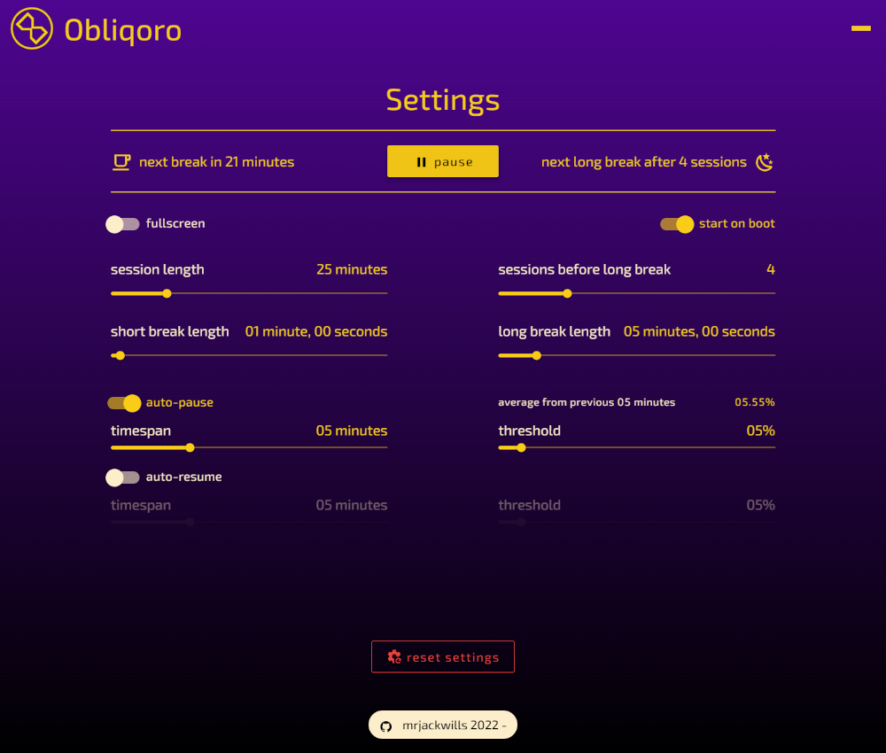

<p align='center'>
 
 <h1 align='center'>Obliqoro</h1>
 <div align='center'>
 <a href='https://en.wikipedia.org/wiki/Oblique_Strategies' target='_blank' rel='noopener noreferrer'>Oblique Strategies</a>
 meets <a href='https://en.wikipedia.org/wiki/Pomodoro_Technique' target='_blank' rel='noopener noreferrer'>Pomodoro</a>
 </div>
</p>

<p align='center'>
 Built in <a href='https://www.rust-lang.org/' target='_blank' rel='noopener noreferrer'>Rust</a>,
 <a href='https://vuejs.org' target='_blank' rel='noopener noreferrer'>Vue3</a>,
 and <a href='https://www.typescriptlang.org/' target='_blank' rel='noopener noreferrer'>Typescript</a>,
 using <a href='https://www.tauri.app/' target='_blank' rel='noopener noreferrer'>Tauri</a>,
 <a href='https://vuetifyjs.com/' target='_blank' rel='noopener noreferrer'>Vuetify</a>,
 and <a href='https://www.sqlite.org/' target='_blank' rel='noopener noreferrer'>SQLite</a>
</p>

<hr>

### Screenshots

<p align='center'>
 <a href='https://raw.githubusercontent.com/mrjackwills/obliqoro/main/.github/screenshot_01.png' target='_blank' rel='noopener noreferrer'>
  
 </a>&nbsp;
 <a href='https://raw.githubusercontent.com/mrjackwills/obliqoro/main/.github/screenshot_02.png' target='_blank' rel='noopener noreferrer'>
  
 </a>
</p>
<p align='center'>
 <a href='https://raw.githubusercontent.com/mrjackwills/obliqoro/main/.github/screenshot_03.png' target='_blank' rel='noopener noreferrer'>
  
 </a>
</p>
<hr>

### About

Obliqoro is an open source, cross platform, graphical application, that combines the creative approach of Oblique Strategies with the time management system of the Pomodoro Technique.

### Features

+ Customisable session and break times
+ Saving of data to SQLite database
+ System tray icon and menu
+ Cross-platform compatibility (Windows and Linux)
+ Overlay window on top of other windows
+ System tray menu inactive during breaks
+ Automated build with `.deb`, `.AppImage`, and `.msi` output, via GitHub Action
+ Launch on boot

### Download + Install

See the <a href='https://github.com/mrjackwills/obliqoro/releases/latest' target='_blank' rel='noopener noreferrer'>pre-built binaries</a>

### Todo

+ [ ] Code sign the application
+ [ ] Translations
+ [ ] Saving strategies into SQLite and enabling the addition of new custom strategies
+ [ ] Statistics for the number of sessions worked
+ [ ] Ability to display on multiple monitors
+ [ ] General code refactoring
+ [ ] Testing on Mac
+ [ ] Password for exiting a long break?
+ [ ] Setting to enable writing logs to file when on production version
+ [x] Notify user if new version available
+ [x] Pause on no/low cpu usage - user controllable setting

### Development

Requires Node & Rust to be installed

```bash
git clone https://www.github.com/mrjackwills/obliqoro.git

npm install
cd src-tauri
cargo install
cargo install tauri-cli

```

Requirements for developing on linux:

```bash
sudo apt update
sudo apt install build-essential \
    curl \
    file \
    libayatana-appindicator3-dev \
    libgtk-3-dev \
    librsvg2-dev \
    libsoup-3.0-dev \
    libssl-dev \
    libssl-dev \
    libwebkit2gtk-4.1-dev \
    libxdo-dev \
    pkg-config \
    wget
```
### arm64 cross compilation

tauri.conf.json:
```json
"targets": ["deb", "msi", "app", "dmg", "updater"],
```

```shell
rustup target add aarch64-unknown-linux-gnu
sudo apt install gcc-aarch64-linux-gnu
```

nano ~/.cargo/config.toml
```toml
[target.aarch64-unknown-linux-gnu]
linker = "aarch64-linux-gnu-gcc"
```

```shell
sudo dpkg --add-architecture arm64

sudo apt-get update && sudo apt-get upgrade -y

sudo apt install libwebkit2gtk-4.0-dev:arm64

export PKG_CONFIG_SYSROOT_DIR=/usr/aarch64-linux-gnu/

cargo tauri build --target aarch64-unknown-linux-gnu
```