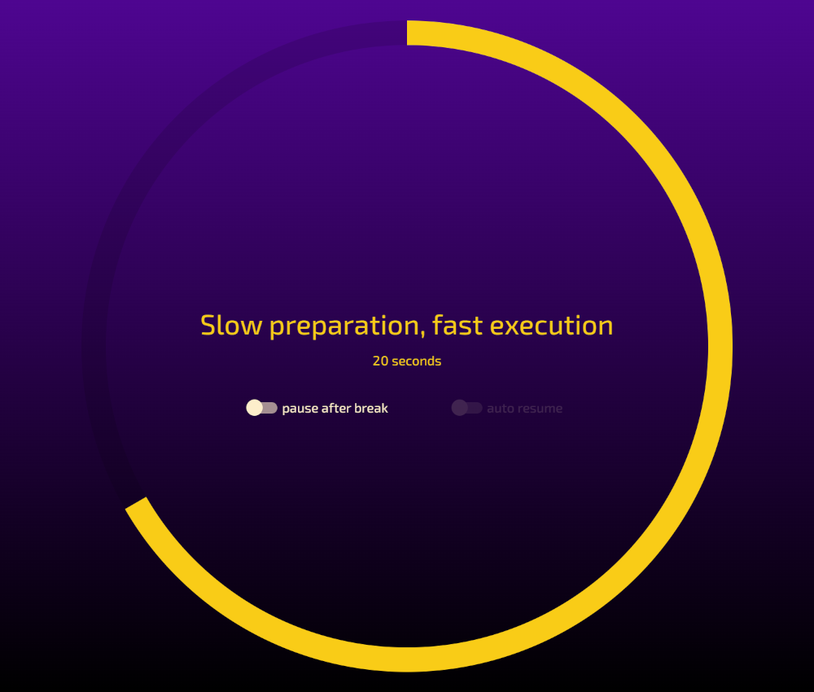

<p align="center">
 
 <h1 align="center">Obliqoro</h1>
 <div align="center">
 <a href='https://en.wikipedia.org/wiki/Oblique_Strategies' target='_blank' rel='noopener noreferrer'>Oblique Strategies</a>
 meets <a href='https://en.wikipedia.org/wiki/Pomodoro_Technique' target='_blank' rel='noopener noreferrer'>Pomodoro</a>
 </div>
</p>

<p align="center">
 Built in <a href='https://www.rust-lang.org/' target='_blank' rel='noopener noreferrer'>Rust</a>,
 and <a href='https://vuejs.org' target='_blank' rel='noopener noreferrer'>Vue3</a>,
 using <a href='https://www.tauri.app/' target='_blank' rel='noopener noreferrer'>Tauri</a>,
 and <a href='https://www.sqlite.org/' target='_blank' rel='noopener noreferrer'>SQLite</a>
</p>

<hr>

### Screenshots

<p align="center">
 <a href="https://raw.githubusercontent.com/mrjackwills/obliqoro/main/.github/screenshot_01.png" target='_blank' rel='noopener noreferrer'>
  
 </a>&nbsp;&nbsp;&nbsp;&nbsp;&nbsp;
 <a href="https://raw.githubusercontent.com/mrjackwills/obliqoro/main/.github/screenshot_02.png" target='_blank' rel='noopener noreferrer'>
  
 </a>
</p>
<hr>

### About

Obliqoro is an open source, cross platform, graphical application, that combines the creative approach of Oblique Strategies with the time management system of the Pomodoro Technique.

### Features

+ Customisable session and break times
+ Saving of data to SQLite database
+ System tray icon and menu
+ Cross-platform compatibility (Windows and Linux)
+ Overlay window on top of other windows
+ System tray menu inactive during breaks
+ Automated build with `.deb`, `.AppImage`, and `.msi` output, via GitHub Action

### Download + Install

See the <a href="https://github.com/mrjackwills/obliqoro/releases/latest" target='_blank' rel='noopener noreferrer'>pre-built binaries</a>

### Todo

+ [ ] Code sign the application
+ [ ] Launch on boot
+ [ ] Translations
+ [ ] Limiting to a single instance running at once
+ [ ] Saving strategies into SQLite and enabling the addition of new custom strategies
+ [ ] Statistics for the number of sessions worked
+ [ ] Ability to display on multiple monitors
+ [ ] General code refactoring
+ [ ] Frontend link to the location of the SQLite file on disk
+ [ ] Testing on Mac
+ [ ] Password protection for exiting a long break
+ [ ] Removal of OpenSSL Rust dependency

### Development

Requires Node & Rust to be installed installed

```bash
git clone https://www.github.com/mrjackwills/obliqoro.git

npm install
cd src-tauri
cargo install
cargo install tauri-cli

```

Requirements for developing on linux:

```bash
sudo apt update
sudo apt install libwebkit2gtk-4.0-dev \
    build-essential \
    curl \
    wget \
    libssl-dev \
    libgtk-3-dev \
    libayatana-appindicator3-dev \
    librsvg2-dev
```
